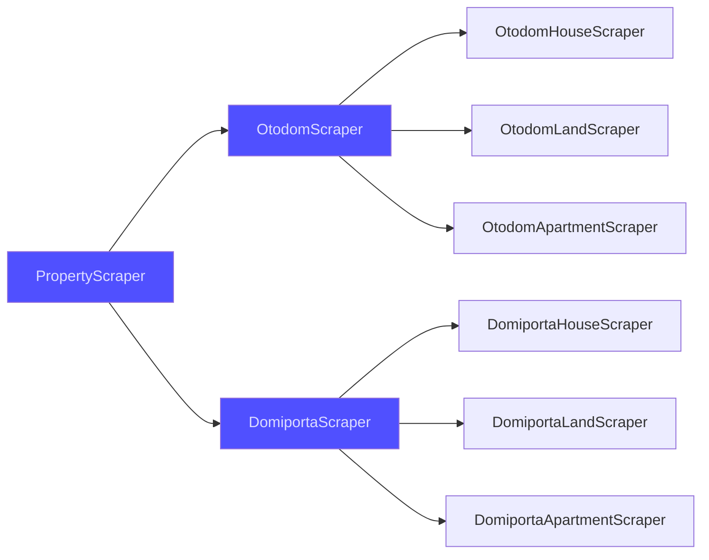
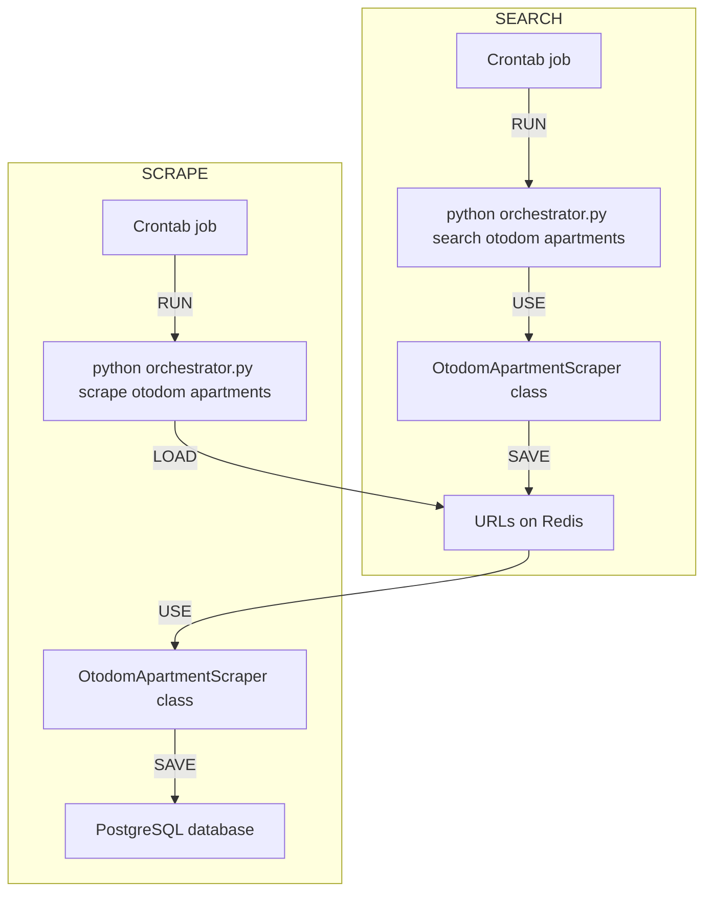

## Project overview
In this project, I developed a system designed for **collection and analysis** of real estate offers. Its primary goal is to **estimate the market value** of various properties, including <u>houses, lands, and apartments</u>. It consists of four stages:
- data scraping
- data visualization
- machine learning model for price estimation
- model API (in progress)

All data is collected exclusively for educational purposes and is not utilized commercially. Personal data is not stored.

## Data scraping
Data used in this project is obtained from two sources: 
- [https://www.otodom.pl/](https://www.otodom.pl/) 
- [https://www.domiporta.pl/](https://www.domiporta.pl/)

For each of them, three property types are considered:
- houses
- lands
- apartments

Web scraping process is implemented using **<span style="color: rgb(65, 65, 240);">abstract classes</span>** and inheritance according to the following scheme:



Each concrete (non-abstract) **class** refers to **one table** in a relational database where data is stored. Moreover, the scraping process is divided into **two separate parts**. For each combination of data source and property type (for example _otodom apartments_), data acquisition process consists of:
- **searching** offers based on assumed filters and saving URL addresses into Redis database
- **scraping** offers corresponding to those URLs and saving them to a database 

All scraping classes are orchestrated by a CLI (Command Line Interface) tool, which enables convenient execution of the appropriate scraper. For instance, you can search URLs of Otodom apartments by:"

```shell
python orchestrator.py search otodom apartments
```

Or scrape offers of lands on Domiporta by:

```shell
python orchestrator.py scrape domiporta lands
```

For each concrete scraping class, the ETL process works according to the flowchart. For the example purposes I'm considering `OtodomApartmentScraper`:



## Data visualization
After the data acquisition process, we move on to the visualization part. For this purpose, I created a <a href="https://real-estate-market-pl.streamlit.app/" target="_blank">web dashboard</a> which contains interactive charts.

On the dashboard you will find:
1. Distributions of:
- house/land/apartment area
- price and price per square meter
- number of offers in various regions

2. Time-related changes in:
- the number of properties offered
- the average price

3. A map featuring marked locations of properties

and even more. Below, you can find examples of figures for:

### Houses
<iframe src="/assets/img/projects/real-estate/houses.html" width="600" height="600"></iframe>

### Lands
<iframe src="/assets/img/projects/real-estate/lands.html" width="500" height="700"></iframe>

### Apartments
<iframe src="/assets/img/projects/real-estate/apartments.html" width="700" height="700"></iframe>


## Model training
In the initial approach, machine learning models were trained only using **Otodom data** as this service provides more information about the properties. A dedicated **Random Forest Regressor** model was developed for each type of property, employing a scikit-learn `Pipeline`. Prior to the model training, a **feature engineering** process was undertaken to preprocess the data before modeling.

The preprocessing steps on the example of **houses data** includes the following:
- Transformation of the advert type (**agency or private**) into a <u>boolean value</u>
- Transformation of the market type (**primary or secondary**) into a <u>boolean value</u>
- <u>Label encoding</u> of the **weekday** and **season** corresponding to when the offer was posted
- Calculating <u>time difference</u> between the offer and an arbitrarily chosen timestamp (2023-01-01) to reflect **offer's position on a timeline**
- <u>Label encoding</u> of the house location (**country/suburban/city**)
- <u>One hot encoding</u> of **province** and **subregion** of the property

For both **further preprocessing** (feature scaling) and **model training**, a <u>grid search</u> was applied using the following parameters:
- `StandardScaler()`, `MinMaxScaler()` for feature scaling
- 400, 500, 600 for `n_estimators`
- 70, 80, 90 for `max_depth`

Additionally, I experimented with feature extraction, however this approach resulted in a decrease in model performance.

The final pipeline, configured for optimal performance in terms of **mean absolute error** (with a use of cross validation), includes the following elements:


<u>Metrics calculated for the whole dataset:</u>

**Mean absolute error** [PLN]: 127951

**Mean absolute percentage error** [%]: 21.5


The model's performance is for from perfect, as it is influenced by various factors including the subjective nature of house evaluations. It effectively handles key aspects like location and size, but the diversity in interior details of houses presents a challenge. Additionally, the model doesn't utilize all property features, which further impacts its accuracy. This current version is an initial step in exploring the possibilities of price modeling, with potential for future enhancements. Its primary goal is to estimate market value, rather than to establish a universal formula for price evaluation.

## API for the model
Work in progress
