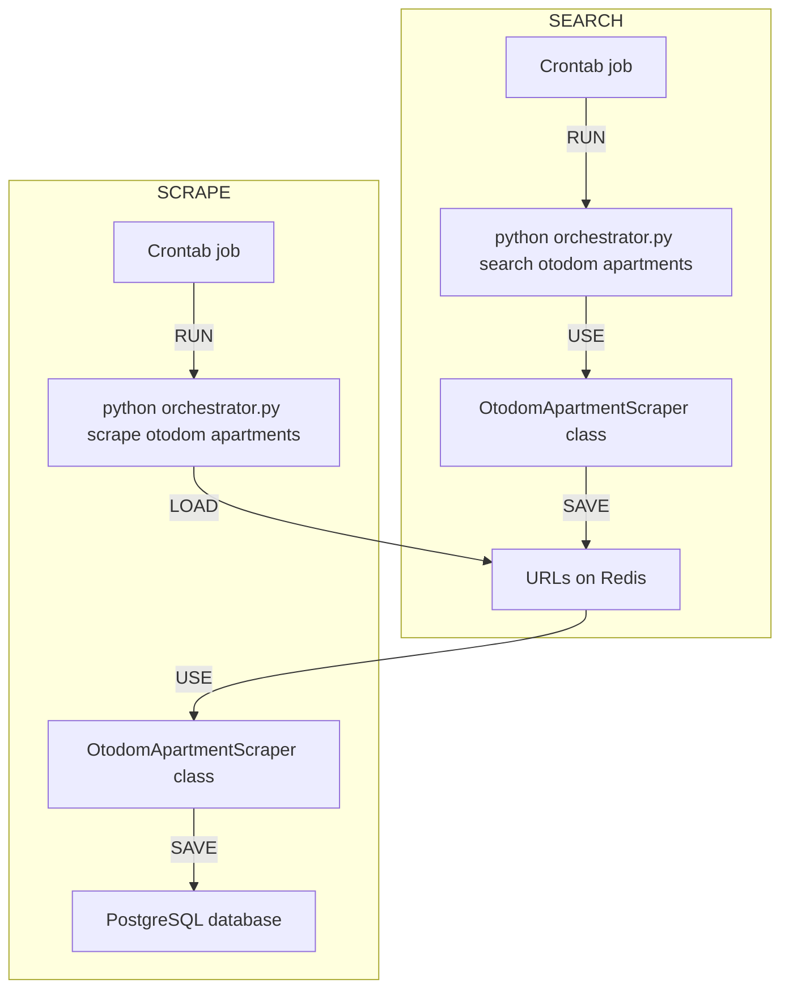

## Opis projektu
W tym projekcie stworzyłem system do **zbierania i analizy** ofert nieruchomości. Głównym celem jest **oszacowanie wartości rynkowej** różnych typów nieruchomości: <u>domów, działek i mieszkań</u>. Projekt składa się z czterech etapów:
- scraping danych
- wizualizacja danych
- model ML do estymacji cen
- API dla modelu (w trakcie)

Wszystkie dane są zbierane wyłącznie w celach edukacyjnych i nie są wykorzystywane komercyjnie. Dane osobowe nie są przechowywane.

## Scraping danych
Dane w tym projekcie pochodzą z dwóch źródeł:
- [https://www.otodom.pl/](https://www.otodom.pl/)
- [https://www.domiporta.pl/](https://www.domiporta.pl/)

Dla każdego z nich uwzględniane są trzy typy nieruchomości:
- domy
- działki
- mieszkania

```mermaid
flowchart LR
    classDef abstractClass fill:#4444ffee, color:#fffc;
    
    PropertyScraper --> OtodomScraper
    PropertyScraper --> DomiportaScraper
    OtodomScraper --> OtodomHouseScraper
    OtodomScraper --> OtodomLandScraper
    OtodomScraper --> OtodomApartmentScraper
    DomiportaScraper --> DomiportaHouseScraper
    DomiportaScraper --> DomiportaLandScraper
    DomiportaScraper --> DomiportaApartmentScraper
    
    class PropertyScraper,OtodomScraper,DomiportaScraper abstractClass;
     
```

Proces scrapingu jest zaimplementowany przy użyciu **<span style="color: rgb(65, 65, 240);">klas abstrakcyjnych</span>** i dziedziczenia według poniższego schematu:



Każda konkretna (nieabstrakcyjna) **klasa** odpowiada **jednej tabeli** w relacyjnej bazie danych, w której zapisywane są dane. Ponadto proces scrapingu jest podzielony na **dwie oddzielne części**. Dla każdej kombinacji źródła danych i typu nieruchomości (np. _mieszkania z Otodom_), proces pozyskiwania danych składa się z:
- **wyszukiwania** ofert na podstawie założonych filtrów i zapisywania adresów URL w bazie Redis
- **scrapowania** ofert odpowiadających tym adresom URL i zapisywania ich w bazie danych

Wszystkie klasy scrapujące są orkiestrowane przez narzędzie CLI (Command Line Interface), które umożliwia wygodne uruchamianie odpowiedniego scrapera. Na przykład, możesz wyszukać URL-e mieszkań z Otodom przez:

```shell
python orchestrator.py search otodom apartments
```

Lub zescrapować oferty działek z Domiporta przez:

```shell
python orchestrator.py scrape domiporta lands
```

Dla każdej konkretnej klasy scrapującej proces ETL działa zgodnie z poniższym schematem. Dla celów przykładowych rozważam `OtodomApartmentScraper`:



## Wizualizacja danych
Po zakończeniu procesu pozyskiwania danych przechodzimy do części wizualizacyjnej. W tym celu stworzyłem <a href="https://real-estate-market-pl.streamlit.app/" target="_blank">dashboard webowy</a>, który zawiera interaktywne wykresy.

Na dashboardzie znajdziesz:
1. Rozkłady:
- powierzchni domów/działek/mieszkań
- ceny i ceny za metr kwadratowy
- liczby ofert w różnych regionach

2. Zmiany w czasie:
- liczby oferowanych nieruchomości
- średniej ceny

3. Mapę z zaznaczonymi lokalizacjami nieruchomości

i wiele więcej. Poniżej znajdziesz przykładowe wykresy dla:

### Domy
<iframe src="/assets/img/projects/real-estate/houses.html" width="600" height="600"></iframe>

### Działki
<iframe src="/assets/img/projects/real-estate/lands.html" width="500" height="700"></iframe>

### Mieszkania
<iframe src="/assets/img/projects/real-estate/apartments.html" width="700" height="700"></iframe>


## Trenowanie modelu
W początkowym podejściu modele ML były trenowane wyłącznie na **danych z Otodom**, ponieważ ten serwis dostarcza więcej informacji o nieruchomościach. Dla każdego typu nieruchomości stworzony został dedykowany model **Random Forest Regressor** przy użyciu `Pipeline` z scikit-learn. Przed trenowaniem modelu przeprowadzony został proces **feature engineering** w celu przygotowania danych.

Kroki preprocessingu na przykładzie **danych o domach** obejmują:
- Przekształcenie typu ogłoszenia (**agencja lub prywatne**) na <u>wartość boolean</u>
- Przekształcenie typu rynku (**pierwotny lub wtórny**) na <u>wartość boolean</u>
- <u>Label encoding</u> **dnia tygodnia** i **pory roku**, w których została dodana oferta
- Obliczenie <u>różnicy czasu</u> między ofertą a arbitralnie wybranym timestampem (2023-01-01), aby odzwierciedlić **pozycję oferty na osi czasu**
- <u>Label encoding</u> lokalizacji domu (**wieś/przedmieścia/miasto**)
- <u>One hot encoding</u> **województwa** i **podregionu** nieruchomości

Zarówno do **dalszego preprocessingu** (skalowanie cech), jak i **trenowania modelu**, zastosowano <u>grid search</u> z następującymi parametrami:
- `StandardScaler()`, `MinMaxScaler()` do skalowania cech
- 400, 500, 600 dla `n_estimators`
- 70, 80, 90 dla `max_depth`

Dodatkowo eksperymentowałem z ekstrakcją cech, jednak to podejście skutkowało pogorszeniem wydajności modelu.

Finalny pipeline, skonfigurowany dla optymalnej wydajności pod względem **mean absolute error** (z użyciem walidacji krzyżowej), zawiera następujące elementy:


<u>Metryki obliczone dla całego zbioru danych o domach:</u>

**Mean absolute error** [PLN]: 165599.68

**Mean absolute percentage error** [%]: 25.7


Wydajność modelu jest daleka od doskonałości, na co wpływa wiele czynników, w tym subiektywny charakter wyceny domów. Model dobrze radzi sobie z kluczowymi aspektami takimi jak lokalizacja czy wielkość, ale różnorodność detali wnętrz stanowi wyzwanie. Dodatkowo model nie wykorzystuje wszystkich cech nieruchomości, co wpływa na jego dokładność. Ta wersja to początkowy krok w eksploracji możliwości modelowania cen, z potencjałem na przyszłe ulepszenia. Głównym celem jest oszacowanie wartości rynkowej, a nie stworzenie uniwersalnej formuły wyceny.

## API dla modelu
API wykorzystuje spiklowane modele przechowywane na Google Cloud Storage. Wspiera dwa typy endpointów GET dla każdego typu nieruchomości:
- `estimate_price_from_json`
- `estimate_price_otodom_offer`

Kod znajdziesz w podlinkowanym repozytorium. API nie jest zhostowane ze względu na duże zużycie pamięci wynikające z ładowania zserializowanych modeli.
