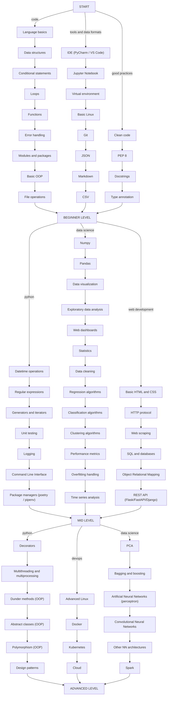

```mermaid
graph TD
    A[START] -->|code| beg_code_1[Language basics]
    beg_code_1 --> beg_code_2[Data structures]
    beg_code_2 --> beg_code_3[Conditional statements]
    beg_code_3 --> beg_code_4[Loops] 
    beg_code_4 --> beg_code_5[Functions] 
    beg_code_5 --> beg_code_6[Error handling] 
    beg_code_6 --> beg_code_7[Modules and packages] 
    beg_code_7 --> beg_code_8[Basic OOP] 
    beg_code_8 --> beg_code_9[File operations] 
    beg_code_9 --> B[BEGINNER LEVEL] 

    A --> |tools and data formats| beg_tools_1["IDE (PyCharm / VS Code)"]
    beg_tools_1 --> beg_tools_2[Jupyter Notebook]
    beg_tools_2 --> beg_tools_3[Virtual environment]
    beg_tools_3 --> beg_tools_4[Basic Linux]
    beg_tools_4 --> beg_tools_5[Git]
    beg_tools_5 --> beg_tools_6[JSON]
    beg_tools_6 --> beg_tools_7[Markdown]
    beg_tools_7 --> beg_tools_8[CSV]
    beg_tools_8 --> B
   
    A -->|good practices| beg_gp_1[Clean code]
    beg_gp_1 --> beg_gp_2[PEP 8]
    beg_gp_2 --> beg_gp_3[Docstrings]
    beg_gp_3 --> beg_gp_4[Type annotation]
    beg_gp_4 --> B
    
    
    B --> |python| mid_python_1[Datetime operations]
    mid_python_1 --> mid_python_2[Regular expressions]
    mid_python_2 --> mid_python_3[Generators and iterators]
    mid_python_3 --> mid_python_4[Unit testing]
    mid_python_4 --> mid_python_5[Logging]
    mid_python_5 --> mid_python_6[Command Line Interface]
    mid_python_6 --> mid_python_7["Package managers (poetry / pipenv)"]
    mid_python_7 --> C[MID LEVEL]
    
    B --> |data science| mid_ds_1[Numpy] 
    mid_ds_1 --> mid_ds_2[Pandas]
    mid_ds_2 --> mid_ds_3[Data visualization]
    mid_ds_3 --> mid_ds_4[Exploratory data analysis]
    mid_ds_4 --> mid_ds_5[Web dashboards]
    mid_ds_5 --> mid_ds_6[Statistics]
    mid_ds_6 --> mid_ds_7[Data cleaning]
    mid_ds_7 --> mid_ds_8[Regression algorithms]
    mid_ds_8 --> mid_ds_9[Classification algorithms]
    mid_ds_9 --> mid_ds_10[Clustering algorithms]
    mid_ds_10 --> mid_ds_11[Performance metrics]
    mid_ds_11 --> mid_ds_12[Overfitting handling]
    mid_ds_12 --> mid_ds_13[Time series analysis]
    mid_ds_13 --> C 
    
    B --> |web development| mid_web_1[Basic HTML and CSS] 
    mid_web_1 --> mid_web_2[HTTP protocol]
    mid_web_2 --> mid_web_3[Web scraping]
    mid_web_3 --> mid_web_4[SQL and databases]
    mid_web_4 --> mid_web_5[Object Relational Mapping]
    mid_web_5 --> mid_web_6["REST API (Flask/FastAPI/Django)"]
    mid_web_6 --> C
    
    
    C --> |python| adv_python_1[Decorators]
    adv_python_1 --> adv_python_2[Multithreading and multiprocessing]
    adv_python_2 --> adv_python_3["Dunder methods (OOP)"]
    adv_python_3 --> adv_python_4["Abstract classes (OOP)"]
    adv_python_4 --> adv_python_5["Polymorphism (OOP)"]
    adv_python_5 --> adv_python_6[Design patterns]
    adv_python_6 --> D[ADVANCED LEVEL]
    
    C --> |devops| adv_devops_1[Advanced Linux]
    adv_devops_1 --> adv_devops_2[Docker]
    adv_devops_2 --> adv_devops_3[Kubernetes]
    adv_devops_3 --> adv_devops_4[Cloud]
    adv_devops_4 --> D
    
    C --> |data science| adv_ds_1[PCA]
    adv_ds_1 --> adv_ds_2[Bagging and boosting]
    adv_ds_2 --> adv_ds_3["Artificial Neural Networks (perceptron)"]
    adv_ds_3 --> adv_ds_4[Convolutional Neural Networks]
    adv_ds_4 --> adv_ds_5[Other NN architectures]
    adv_ds_5 --> adv_ds_6[Spark]
    adv_ds_6 --> D
```
